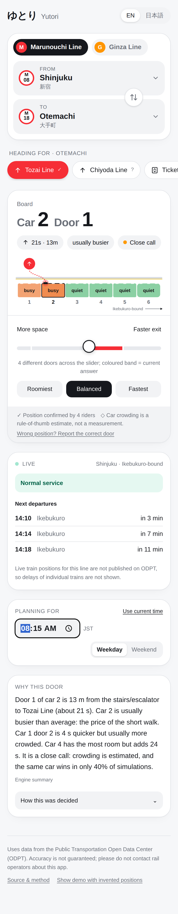
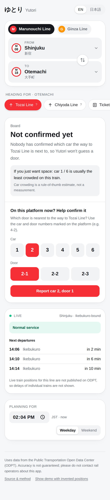
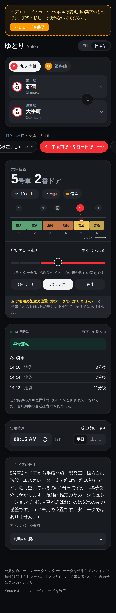

# Yutori (ゆとり) — which door should you board?

On a Tokyo Metro train, the car next to the transfer stairs is the most crowded,
and the empty end car can leave you a long walk down the platform at your
destination. Yutori tells you which car and door to board for your trip, and lets
you slide between **getting out fast** and **having room**.

It is built to be relied on, so it **never presents a guess as data**. A door is
recommended only when the position of the exit on the platform has been
confirmed. Positions come from riders, and a position counts only once at least
three people on different networks agree.

<p align="center">
  
  
  
</p>

## Why rider reports?

The app needs to know *which car and door each staircase, escalator and lift
is next to*. This project checked every channel the official open-data platform
(ODPT) offers: the query API, the bulk dumps, the dataset catalogue and the
GTFS-Realtime feeds. **None of them publish platform positions**
(`odpt:StationFacility` returns 404, and the dump file does not exist). Neither do they publish
Tokyo Metro train positions or per-car crowding (details and dates in
[docs/DATA.md](docs/DATA.md)).

So the positions come from the people standing on the platform. They read the
car and door numbers painted there (e.g. `4-2`) and tap them in. The app turns
those reports into a position only when they agree:

* one vote per network address (one person with many browser profiles counts once);
* the median of the reported positions (robust to a mistaken or malicious report);
* **verified** at ≥ 3 reports with ≥ 75 % within one door of each other;
  otherwise *pending* or *disputed*, and then **no door is recommended**.

Reporting in the platform's own car numbers also means the answer never depends
on assumptions about which end of the train car 1 is at.

## What a rider sees

| Situation | What the app shows |
|---|---|
| Exit position verified (riders or survey) | "Board car 2, door 1": walk time, relative crowding, robustness, slider |
| Exit position not yet verified | **No door.** "Not confirmed yet", the usually-quietest car (labelled as an estimate), and a one-tap way to confirm it from the platform |
| Live ODPT data | Service status (平常運転 / disruptions) and the next departures from the real timetable |
| No live data | Says "unavailable"; never shows placeholder trains or times |
| Demo mode (footer link, off by default) | Invented positions, with a banner on every screen saying not to use them for real trips |

Crowding per car is a rule-of-thumb estimate (no operator publishes per-car
load), so it is shown as *usually quieter / about average / usually busier*,
never as a made-up percentage. It also counts for half as much as walking time
measured from a verified position.

## How it works

```
             browser                                      server (Next.js route handlers)
┌──────────────────────────────────┐  /api/layouts  ┌──────────────────────────────────┐
│ Planner UI (React)               │ ─────────────▶ │ rider reports → consensus        │──▶ Postgres
│  · route, exit, slider, time     │  /api/reports  │  (one vote per network, median,  │    (Neon / PGlite)
│  · one-tap position reports      │ ─────────────▶ │   ≥3 agreeing → verified)        │
│                                  │                ├──────────────────────────────────┤
│ engine (pure TS, runs in browser)│   /api/live    │ ODPT client                      │
│  · geometry  → door positions    │ ─────────────▶ │  · TrainInformation  (60 s cache)│──▶ ODPT v4
│  · crowding  → relative estimate │                │  · StationTimetable  (6 h cache) │
│  · pareto    → frontier + pick   │  /api/narrate  ├──────────────────────────────────┤
│  · stability → robustness        │ ─────────────▶ │ recompute plan server-side       │
│  · explain   → EN/JA template    │   query only   │ → LLM rephrase, unit-checked     │──▶ Groq (optional)
└──────────────────────────────────┘                └──────────────────────────────────┘
```

* `src/engine/`: the optimisation model, with no framework code. [docs/MODEL.md](docs/MODEL.md)
  has the equations and every assumption.
* `src/core/consensus.ts`: rider reports → verified / pending / disputed.
* `src/core/positions.ts`: precedence rules: surveyed > rider-verified > demo (only in demo mode) > unknown.
* `src/data/`: lines and stations (verified against ODPT) and the exits per station.
* `src/server/`: ODPT client, report store, rate limiting, LLM narration (`server-only`).
* `src/ui/`: the interface.

### Design decisions

* **No recommendation without a verified position.** An honest "not confirmed
  yet" beats a confident wrong door.
* **The LLM never decides, and only describes real positions.** The server
  recomputes the plan from the query. Output is rejected if it cites any number
  the engine didn't produce, in the wrong unit, or calls a door "fastest" when
  it isn't. Demo positions are never narrated.
* **Estimated crowding is discounted** (×0.5) against walking time from a
  verified position. A rule of thumb shouldn't overrule a measurement at equal
  weight.
* **The solver runs on the client**, so moving the slider involves no round trip.

## Run it

```bash
npm install
cp .env.example .env.local   # ODPT keys; optional Groq key, DATABASE_URL, REPORT_SALT
npm run dev                  # http://localhost:3000
```

Locally, rider reports go to an embedded Postgres (PGlite) in `.data/`. In
production, set `DATABASE_URL` (see below). Without it, a Vercel deployment turns
reporting off instead of silently losing reports.

```bash
npm run check        # eslint + tsc + vitest (52 tests)
npm run build
npm run odpt:probe   # print what ODPT actually returns for these lines
```

The tests cover:

* the engine: geometry, a Pareto sweep checked against brute force, solver
  endpoints, the crowding discount, and the model;
* consensus: troll reports, disputes, invalid input;
* a **"no door without a verified position" rule** for pending, disputed and demo states;
* the report API on a real embedded Postgres: one vote per network, vote
  changes, rate limits;
* ODPT parsing and JST service-day handling;
* the narration checker, including a real model output it caught misusing a number.

### Deploying for real users (Vercel + free Postgres)

1. Import the repo into Vercel.
2. Add a Postgres database from Vercel's storage marketplace (Neon has a free
   tier). This sets `DATABASE_URL`; the table is created on first use.
3. Set `ODPT_CONSUMER_KEY`, `REPORT_SALT` (a long random string) and optionally
   `GROQ_API_KEY` in Project Settings → Environment Variables.

## Privacy

Reports store the station, exit, car and door, plus **salted SHA-256 hashes** of
a random per-browser id and of the IP address (to stop ballot stuffing). There
are no accounts, no location tracking, and no raw IPs.

## Roadmap

1. Get the first stations verified by real riders: Otemachi, Shinjuku and Tokyo
   first, by asking Tokyo-based student and developer communities.
2. Rider-reported **crowding** ("car 3 is packed right now") with time decay,
   replacing the estimate where reports are recent.
3. Add a line whose train positions ODPT does publish (Toei), so live delays feed the plan.
4. Calibrate the crowding model with ODPT `PassengerSurvey` ridership and report its error.

## Data credit

This app uses data from the Public Transportation Open Data Center (公共交通オープンデータセンター,
ODPT). The accuracy and completeness of the data are not guaranteed. Please do
not contact rail operators about this app.
