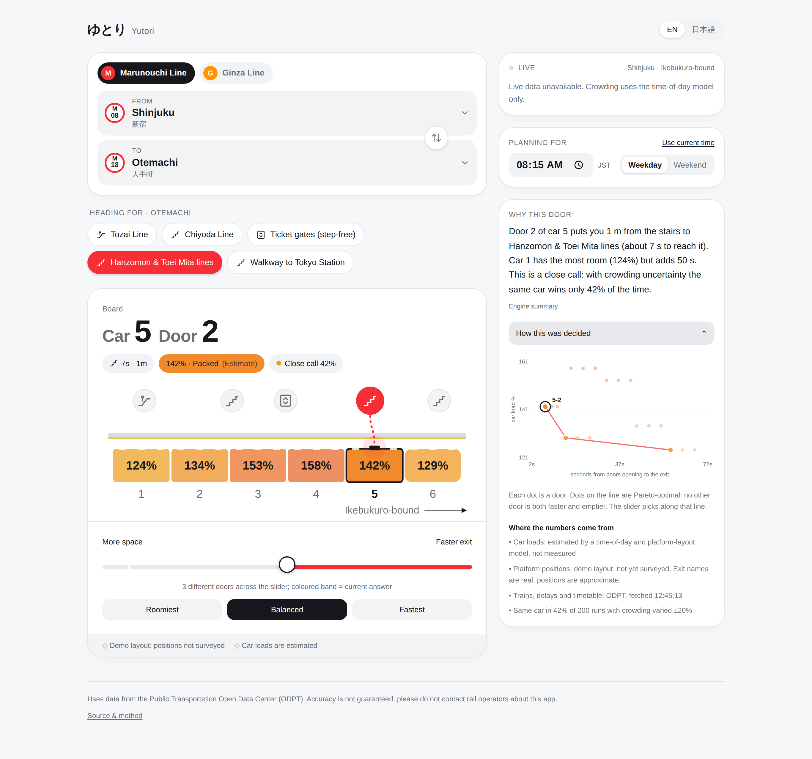

# Yutori (ゆとり) — which door should you board?

On a Tokyo Metro train, the car next to the transfer stairs is the most crowded,
and the empty end car can leave you a long walk down the platform at your
destination. Yutori tells you the car and door to board for your trip, and lets
you slide between **getting out fast** and **having room**. It shows every number
together with where it came from.

<p align="center">
  
  
</p>



## What it does

1. Pick a line (Marunouchi or Ginza), where you get on, where you get off, and
   which exit or transfer you need there.
2. The engine checks every (car, door) pair: walking time to that exit, plus the
   load of that car.
3. It keeps the **Pareto-optimal** doors (no other door is both faster *and* emptier)
   and picks one according to the slider. The slider track shows the ranges where
   the answer stays the same, so a trip with no real trade-off looks like one.
4. It tells you how robust the pick is ("Solid pick" / "Close call") by re-solving
   200 times with the crowding numbers perturbed.
5. Live ODPT data (service disruptions, approaching trains and their delay, next
   departures) is shown next to the answer. A delayed train raises the crowding
   estimate.
6. It explains the decision in English and Japanese. An LLM may rephrase that
   explanation, but output citing any number the engine did not produce is
   thrown away.

## Honest status

| | |
|---|---|
| Station data, line geometry, Pareto solver, robustness check | done, tested |
| Live service status, train positions, delays, timetable (ODPT) | implemented against the ODPT v4 schema; **run `npm run odpt:probe` to verify against live responses** |
| Per-car crowding | **estimated** by a documented model. ODPT has no known public per-car load field; the app switches to live loads automatically if one is configured |
| Platform exit positions | **demo layouts** for 12 stations. The exits are real; their positions along the platform are not surveyed yet ([how to survey](docs/DATA.md#surveying-a-station-turning-a-demo-layout-into-a-surveyed-one)) |

The UI never shows a placeholder as if it were data: missing live data reads
"unavailable", estimates are labelled as estimates, and stations without
platform data get no recommendation.

## How it works

```
             browser                                      server (Next.js route handlers)
┌──────────────────────────────────┐   /api/live    ┌──────────────────────────────────┐
│ Planner UI (React)               │ ─────────────▶ │ ODPT client                      │
│  · route, exit, slider, time     │   every 30 s   │  · TrainInformation  (60 s cache)│──▶ ODPT v4
│                                  │ ◀───────────── │  · Train             (20 s cache)│
│ engine (pure TS, runs in browser)│                │  · StationTimetable  (6 h cache) │
│  · geometry  → door positions    │                │  · keys never leave the server   │
│  · crowding  → per-car estimate  │  /api/narrate  ├──────────────────────────────────┤
│  · pareto    → frontier + pick   │ ─────────────▶ │ recompute plan from the query    │
│  · stability → robustness        │   query only   │ → template explanation           │──▶ Groq (optional)
│  · explain   → EN/JA template    │ ◀───────────── │ → LLM rephrase, number-checked   │
└──────────────────────────────────┘                └──────────────────────────────────┘
```

* `src/engine/`: the model, with no framework code. [docs/MODEL.md](docs/MODEL.md)
  has the equations, every assumption, and why min–max normalisation was replaced
  with fixed scales.
* `src/data/`: lines, stations (EN/JA), demo platform layouts.
  [docs/DATA.md](docs/DATA.md) lists the provenance of each source and what still
  needs verifying.
* `src/core/`: wiring (plan, live parsing, explanations, Japan-time service-day
  handling).
* `src/server/`: the ODPT client, LLM narration and rate limiting. Nothing here
  is bundled to the browser (`server-only`).
* `src/ui/`: the interface. Native `<select>` for stations (the phone's own
  picker), an SVG platform diagram, the slider with answer bands, and a Pareto
  chart.

### Design decisions

* **The solver runs on the client.** Moving the slider is a pure function of
  data already loaded, so there is no network round trip.
* **No database.** The specification proposed PostgreSQL and Redis. With 44
  stations and 12 layouts, version-controlled TypeScript data is easier to
  review and test, and costs nothing to host. A database becomes worthwhile once
  layouts are crowd-sourced.
* **Fixed objective scales instead of min–max.** Min–max made 42 % vs 54 % (seats
  free everywhere) look as large as 60 % vs 200 %. See MODEL.md §3.
* **The LLM is optional and fenced.** The deterministic template is always the
  baseline, and the narration route recomputes the plan from the query instead
  of trusting numbers from the client.

## Run it

```bash
npm install
cp .env.example .env.local   # add ODPT keys (and optionally a Groq key)
npm run dev                  # http://localhost:3000
```

Without any keys the app still works: it plans from the time-of-day model and
says that live data is unavailable.

```bash
npm run check        # eslint + tsc + vitest
npm run build
npm run odpt:probe   # print what ODPT actually returns for these lines
```

Tests (`vitest`, 32 cases) cover door geometry, the Pareto sweep against a
brute-force check on random inputs with ties, solver endpoints and
breakpoints, a < 2 ms solve for 40 candidates, the crowding model, stability
determinism, ODPT parsing (service status, approaching trains, timetables
across midnight, per-car field validation), JST service-day handling, and the
narration checker.

## Roadmap

1. Run the ODPT probe and record its output in `docs/`; correct anything it contradicts.
2. Survey the 12 demo stations and mark them `surveyed`.
3. Calibrate the crowding model (published line congestion rates, a few manual
   per-car counts) and report the error.
4. Add more lines. The engine already handles any car count and door count; the
   Tozai and Chiyoda lines (10 cars, 4 doors) are the obvious next ones.
5. Model Japanese public holidays in the day-type logic.

## Data credit

This app uses data from the Public Transportation Open Data Center (公共交通オープンデータセンター,
ODPT). The accuracy and completeness of the data are not guaranteed. Please do
not contact rail operators about this app.
